# RxSwiftConnect
RxSwiftConnect is similar Retrofit for iOS synonym name Retrofit iOS, We work with ReactiveX.io and Quicktype.io 
use our experience to compile result name RxSwiftConnect. SampleProject Result, as illustrated below. 
<p>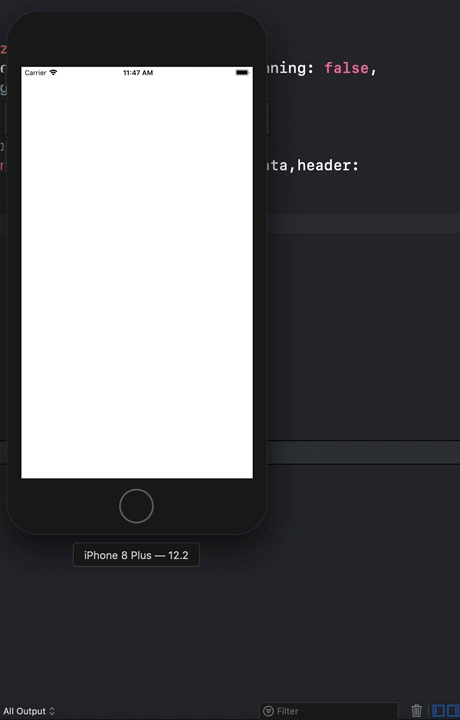</p>
<br />
<br />
RxSwiftConnect included Handle, as illustrated below. 
<p float="left">
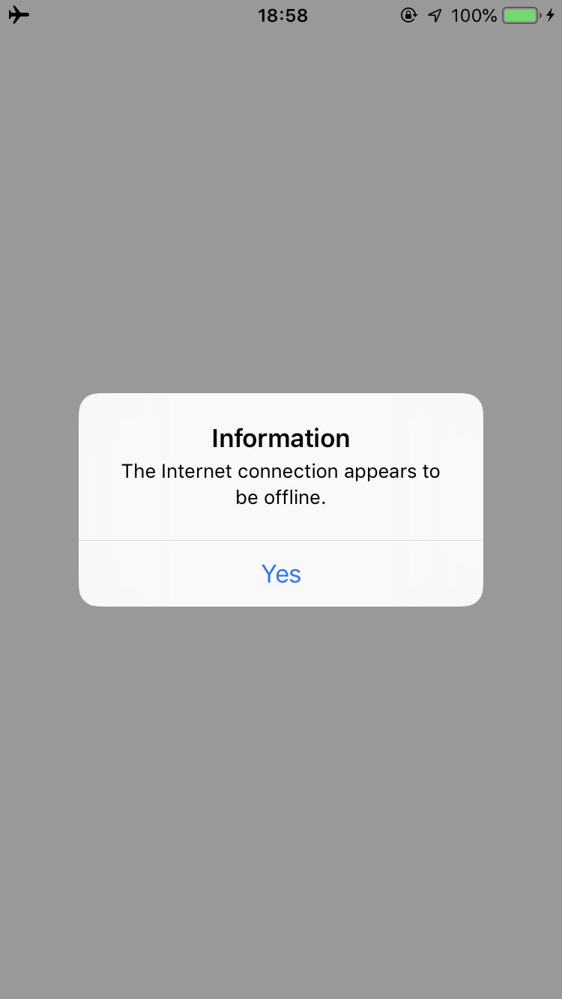
&nbsp;&nbsp;&nbsp;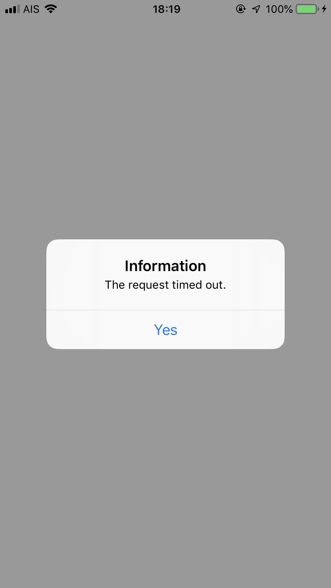
&nbsp;&nbsp;&nbsp;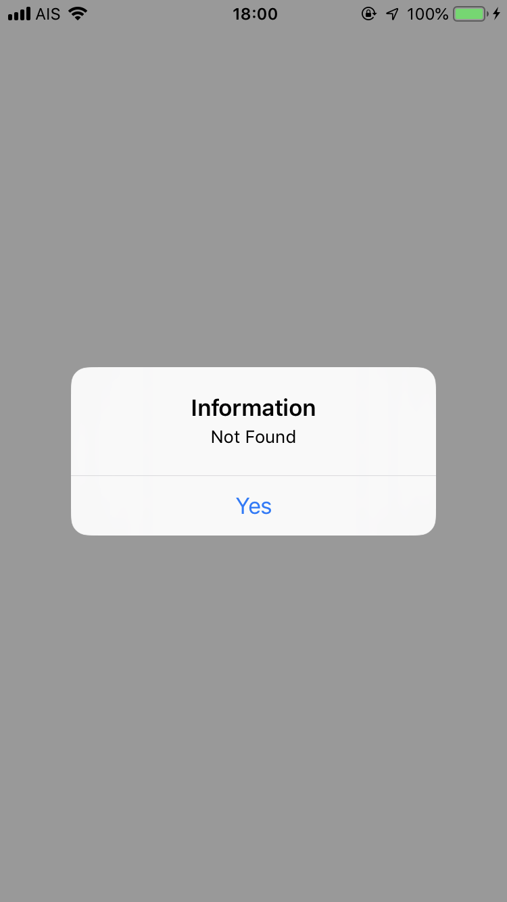
&nbsp;&nbsp;&nbsp;
&nbsp;&nbsp;&nbsp;
</p>
<br />
<br />
Defending Against Man-in-the-Middle Attack (MITM) between API Server and iOS Mobile Application even though 
there was installed SSL on API Server. Attacker or Hacker able to listens package on network comunication using by
Burp this software provided by PortSwigger. MITM is one of top ten of hight vulnerable recommended by OWASP and one of law of    mobile penetration test (pentest). Images illustrated below demonstrate instruction defending Man-in-the-Middle Attack (MITM)
<br />
<br />
Image 1. Looking for correct ceftificated which related with domain API and export SSL from Window Server.
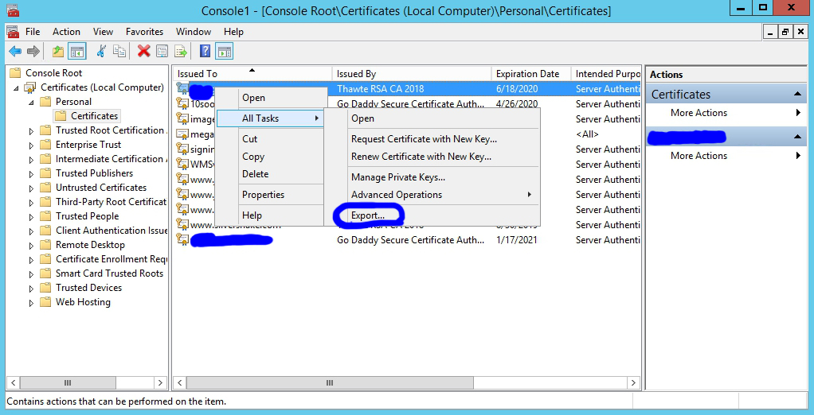
Image 2. Choose export private key.
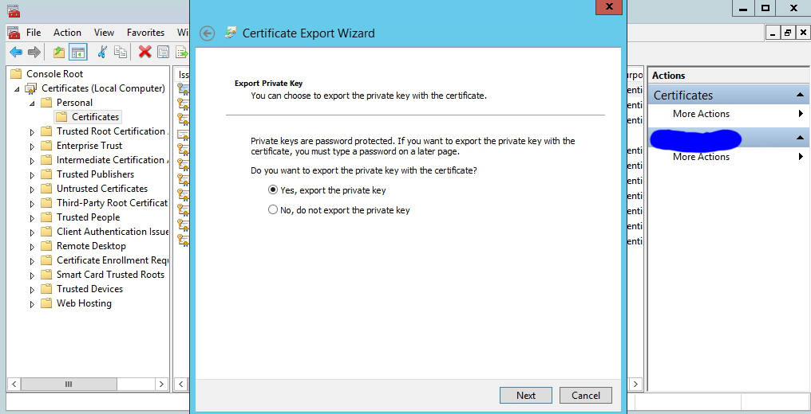
Image 3. Choose PKCS and also included all certificates.
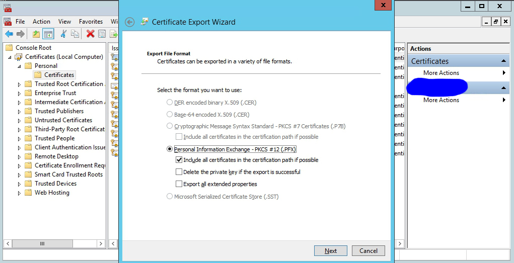
Image 4. Create password it will be used gennerate .cer on iOS.
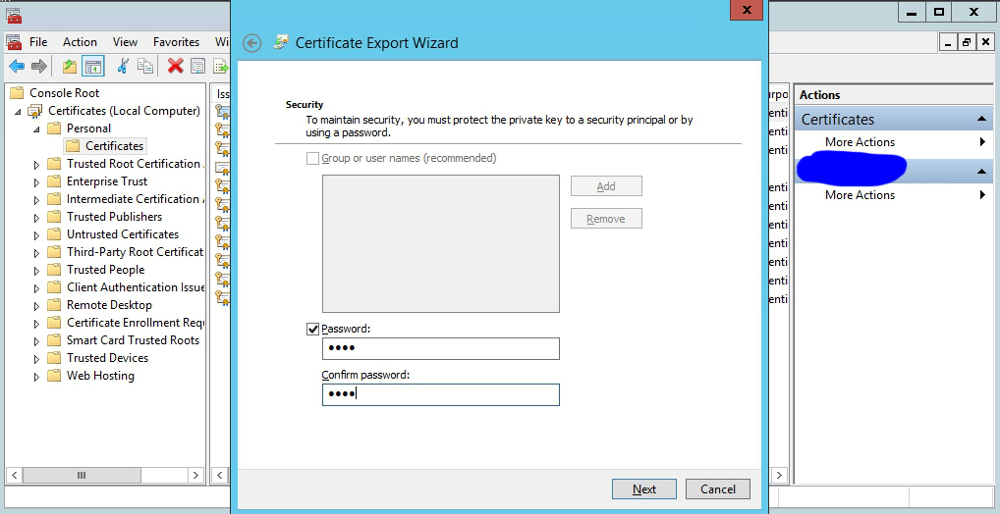
Image 5. Names file "input.pfx".
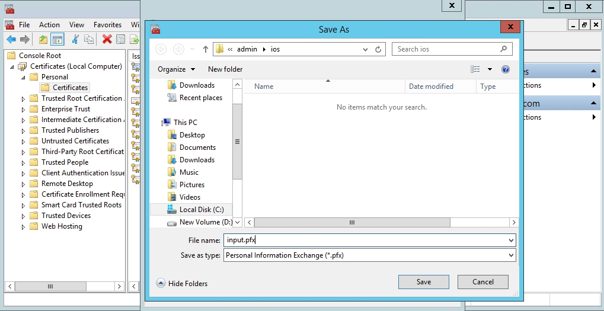
Image 6. Click finish's button.
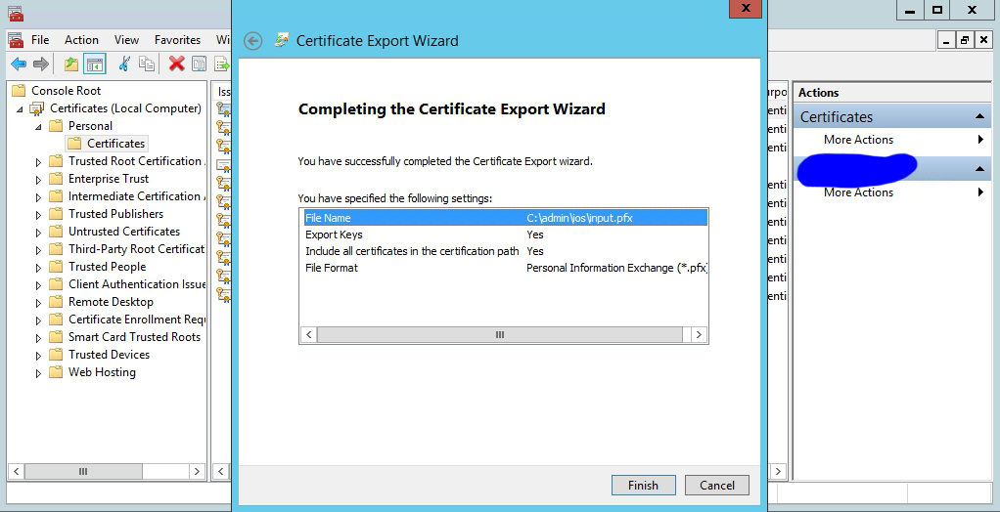
Image 7. Copy file "input.pfx" and transfer to Mac.
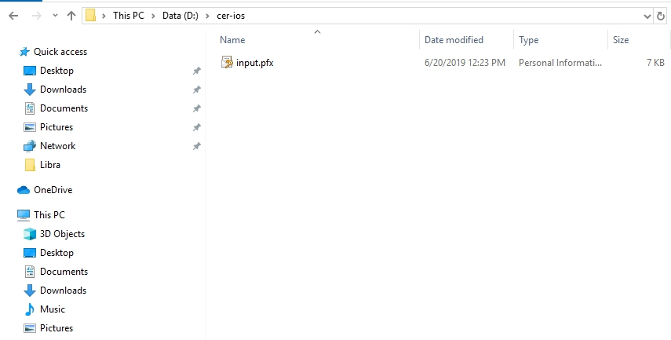
Image 8. Open folder on Mac.
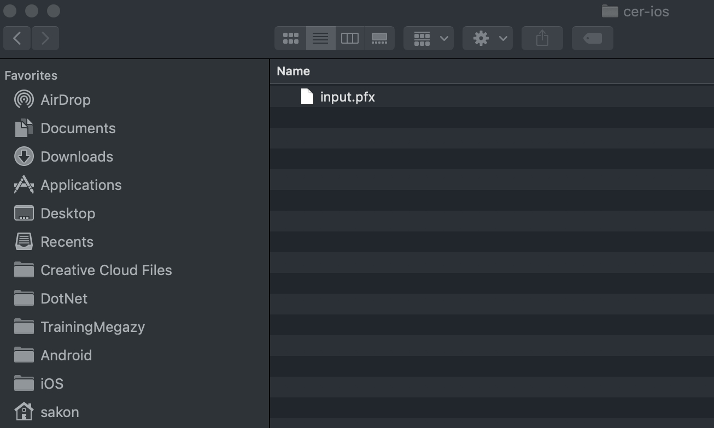
Image 9. Run terminal and write command follow image.
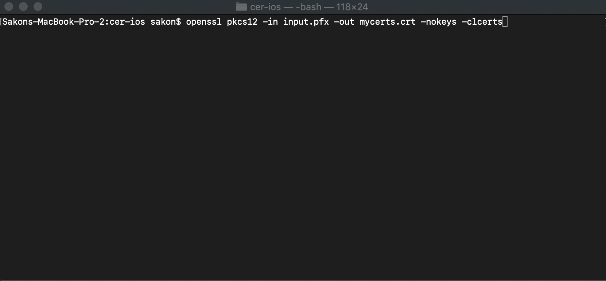
Image 10. It will be seen file "mycerts.crt".
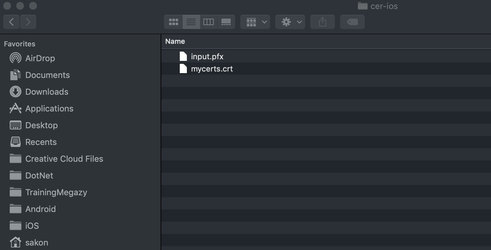

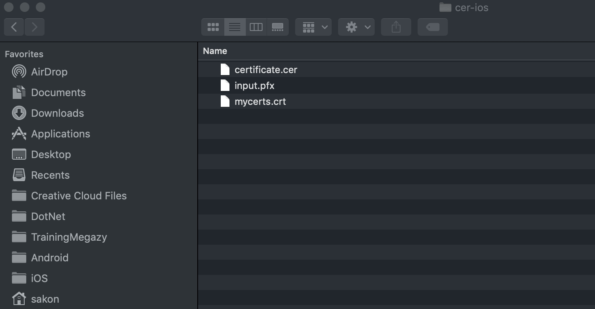
Image 13.
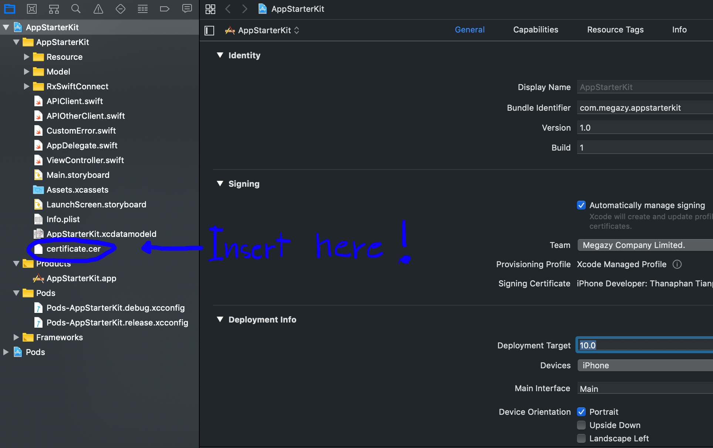
Image 14.
<br />
<br />

Support RxSwift 5

```pod
pod 'RxSwiftConnect', '~> 2.8'
```


