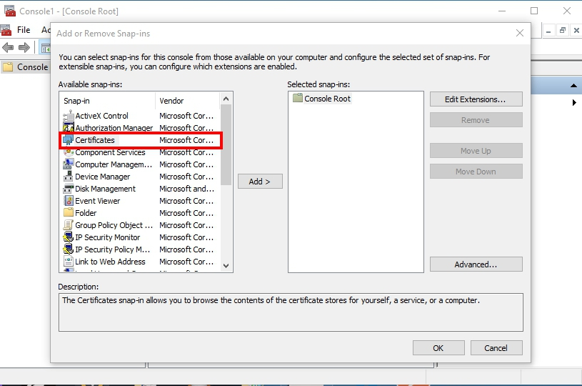
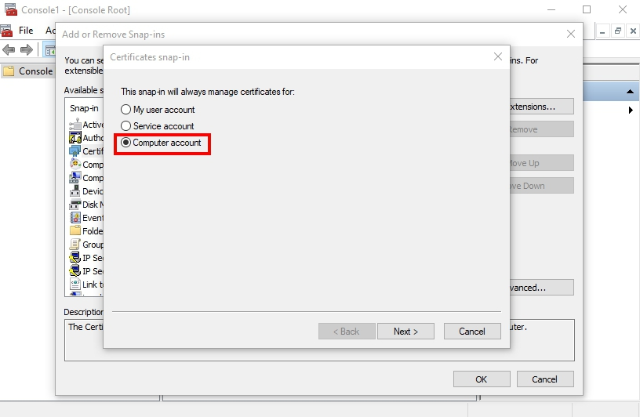
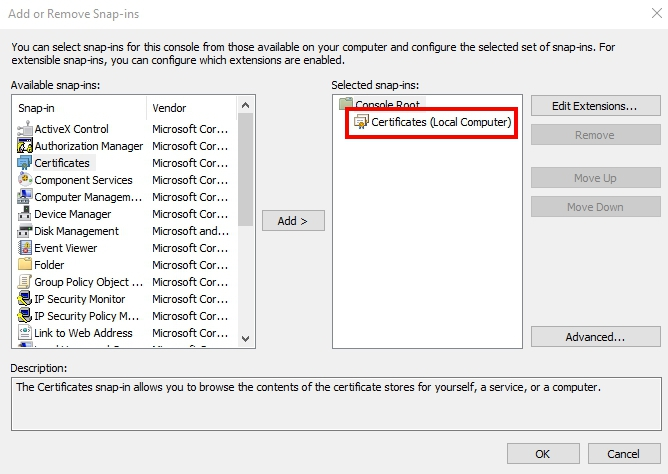
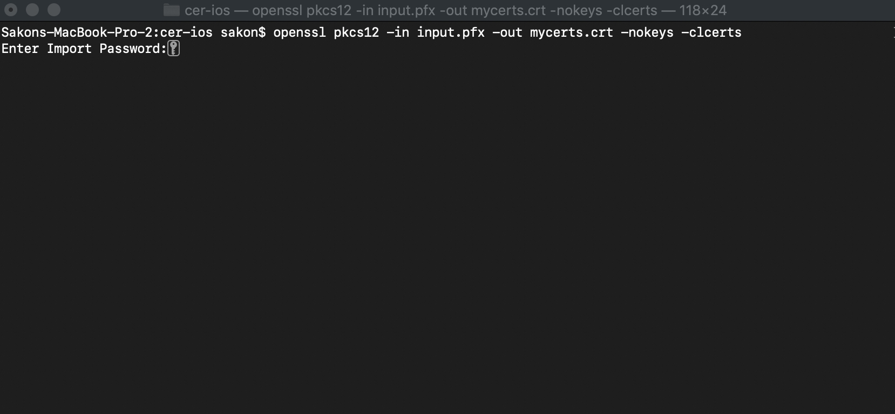
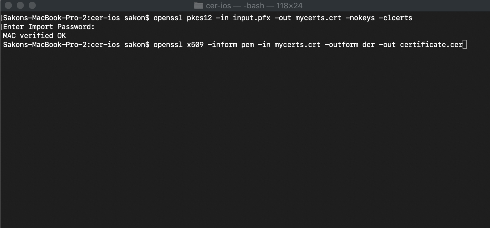

# RxSwiftConnect
RxSwiftConnect, also known as Retrofit for iOS, is a framework that serves as a protection against 
Man-in-the-Middle Attack (MITM). According to https://us.norton.com/, a man-in-the-middle attack is 
like eavesdropping. It is an attack where the attacker secretly relays and possibly alters the communications
between two parties who believe they are directly communicating with each other (Wikipedia).
After years of trials and tests, working with ReactiveX.io and Quicktype.io, 
RxSwiftConnect was finally born. 

Support RxSwift 5
```pod
pod 'RxSwiftConnect', '~> 2.8'
```
Shown below are sample project results;
<p></p>
<br />
How to coding and use RxSwiftConnect Framework?
<br >
1. Set End Point

```EndPoint
let beseUrl = "https://jsonplaceholder.typicode.com"
```

2. Set URL API Service

```APIClient
func getOtherUser() -> O<R<OtherUser,E>> {
  return requester.get(path: "posts")
}
```

3. Create Model for receive result's data from API Service, uses https://quicktype.io to Auto-Generate Code, as illustrated below.

```Model
import Foundation

struct OtherUserElement: Codable {
    let userID, id: Int
    let title, body: String
    
    enum CodingKeys: String, CodingKey {
        case userID = "userId"
        case id, title, body
    }
}

typealias OtherUser = [OtherUserElement]
```

4. Finish and RUN!!

```ViewController
apiOther.getOtherUser()
.observeOn(MainScheduler.instance)
.subscribe(onNext:{ r in

    guard let result = r.value else{
        return self.alertPopup(initMessage: r.error!.errorFriendlyEn!)
    }
    result.forEach {
        print("User ID: \($0.id), User Title: \($0.title)")
    }
},onError:{ e in
    self.alertPopup(initMessage: "Application Error")
}).disposed(by: stepBag)
```            

RxSwiftConnect included Handle error, as illustrated below. 
<p float="left">

&nbsp;&nbsp;&nbsp;
&nbsp;&nbsp;&nbsp;
&nbsp;&nbsp;&nbsp;
&nbsp;&nbsp;&nbsp;
</p>
<br />
Instruction gennerates Model vai Quicktype.io there're two solution, the best solution Model by JSON Schema
if your team are developing API Server by C# easy to Generate JSON Schema following link https://blog.quicktype.io/swift-types-from-csharp it help iOS Developer enhancement mirror Model from API Server and avoid error from object null and
error from complex JSON Structure, as illustrated below. 
<br />
1. Copy example JSON Schema from bellow.
<br />

```JSON Schema
{
  "definitions": {
    "BannerInfo": {
      "type": [
        "object",
        "null"
      ],
      "properties": {
        "Image": {
          "type": [
            "string",
            "null"
          ]
        },
        "IdentityType": {
          "type": "integer"
        },
        "BannerType": {
          "type": [
            "string",
            "null"
          ]
        },
        "PopUpText": {
          "type": [
            "string",
            "null"
          ]
        }
      },
      "required": [
        "Image",
        "IdentityType",
        "BannerType",
        "PopUpText"
      ]
    }
  },
  "type": "object",
  "properties": {
    "Result": {
      "type": [
        "array",
        "null"
      ],
      "items": {
        "$ref": "#/definitions/BannerInfo"
      }
    }
  },
  "required": [
    "Result"
  ]
}
```

<br />
2. Paste JSON Schema on https://app.quicktype.io and changed Source type to "JSON Schema".

<br />
Or Basic Solution create Model by JSON Data, as illustrated below. 
<br />
1. Go directly to https://jsonplaceholder.typicode.com/posts .

2. Copy result's response and post on https://app.quicktype.io .

RxSwiftConnect serves as a defense against Man-in-the-Middle Attack (MITM) between API Server and iOS 
Mobile Application. An installed SSL on API Server doesn't guarantee non- vulnerability of your data and privacy 
online. Attacker or hacker may be able to track your data on network communication by using Burp, a software
 provided by PortSwigger. MITM is named as one of the top ten most common types of cyber attacks as highted 
by OWASP https://www.owasp.org/index.php/Mobile_Top_10_2016-Top_10 . Below are images of the installation and setting- up of RxSwiftConnect.
<br />
1. Run mmc on Window Server it will be showed popup below.

2. Choose "Computer Account".

3. Choose "Certificates" and click "OK" button.

4. Looking for correct ceftificated which related with domain API and export SSL from Window Server.

5. Choose export private key.

6. Choose PKCS and also included all certificates.

7. Create password it will be used gennerate .cer on iOS.

8. Names file "input.pfx".

9. Click finish's button.

10. Copy file "input.pfx" and transfer to Mac.

11. Open folder on Mac.

12. Run terminal and write command follow image.

13. It will be seen file "mycerts.crt".

14. Run terminal to export certificate it's be used in XCODE

15. There's a file "certificate.cer".

16. Additional file "certificate.cer" to iOS project.

17. Finish change status "isPreventPinning = true" of RxSwiftConnect to protect MITM  and RUN!!

```ChangeStatus
private init() {
        let beseUrl = "https://webstarter.megazy.com"
        requester = Requester(initBaseUrl: beseUrl,timeout: 5, isPreventPinning: true, initSessionConfig: URLSessionConfiguration.default)
    }
```


